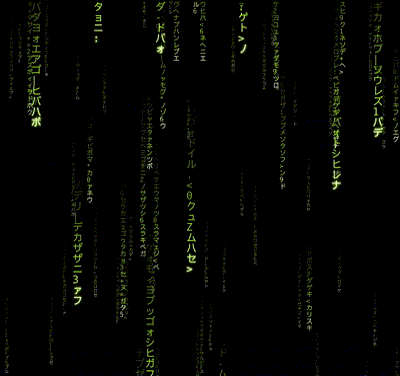

# Matrix Rain Background

A lightweight, customizable "Matrix" digital rain effect for website backgrounds, drawn on an HTML `<canvas>` with plain JavaScript. No libraries, no build step.



## Features

- Falling katakana, digits and symbols with fading trails
- Three depth layers (far, middle, near) for a parallax feel
- Every setting lives in one `CONFIG` block at the top of the file
- Designed as a fixed full-screen background behind your page content (CSS included in the quick start)
- Sharp on high-DPI screens, and slows down for users who prefer reduced motion

## Quick start

1. Put `matrix-rain.js` in your project.
2. Add this to your HTML:

```html
<canvas></canvas>
<script src="matrix-rain.js"></script>
```

Your page needs a `<canvas>` element, since the script looks it up with `document.querySelector('canvas')`. The script does not style the canvas, so add this CSS to make it a fixed, full-screen layer behind your content (your text and buttons stay clickable):

```css
canvas {
  position: fixed;
  top: 0;
  left: 0;
  width: 100vw;
  height: 100vh;
  z-index: -1;
  pointer-events: none;
}
```

## Configuration

Open `matrix-rain.js` and edit the `CONFIG` block at the top. You don't need to touch anything below it.

### General

| Variable | Default | What it does |
|---|---|---|
| `speed` | `1` | Global speed multiplier. `0.5` is half speed, `2` is double. |
| `density` | `1` | Global multiplier for the number of drops. `0.5` is half as many, `2` is twice as many. |
| `bgColor` | `'#000000'` | Background color. |
| `trailFade` | `0.32` | Low values (e.g. `0.05`) give long glowing smears. `1` gives crisp trails with no smear. |
| `trailLength` | `1` | Global trail length multiplier. `0.5` is short, `2` is long. |

### Colors

| Variable | Default | What it does |
|---|---|---|
| `color` | `'#AFFF33'` | Main rain and trail color. |
| `headColor` | `'#EFFFD0'` | Color of the bright leading character of each drop. |

### Characters and font

| Variable | Default | What it does |
|---|---|---|
| `chars` | katakana + digits + symbols | The characters that can appear. Replace with any string, e.g. `'01'` for binary rain. |
| `font` | MS Gothic / Noto Sans Mono CJK JP / monospace | Font stack used to draw the characters. |
| `mutation` | `0.35` | How often trail characters change (0 = never, 1 = constantly). |

### Depth layers

`layers` is an array, and each entry is one depth layer. Order them from far to near. You can add, remove or edit layers freely.

| Variable | Example | What it does |
|---|---|---|
| `fontSize` | `18` | Glyph size in pixels. Also sets the column width, so smaller means more columns. |
| `speed` | `[9, 15]` | Min and max fall speed in rows per second. Each drop picks a random value in the range. |
| `trail` | `[12, 28]` | Min and max trail length in characters. |
| `brightness` | `0.7` | Layer brightness from 0 to 1. Use lower values for far layers. |
| `glow` | `14` | Glow radius in pixels on the leading character. `0` turns it off. Higher values cost more performance. |
| `density` | `0.45` | Share of columns (0 to 1) that have a drop in this layer. |

### Example presets

**Slow, calm, dim (good behind text):**
```js
speed: 0.5,
density: 0.7,
opacity: 0.5,
```

**Classic green:**
```js
color: '#00FF8C',
headColor: '#FFFFFF',
bgColor: '#000000',
```

**Binary rain:**
```js
chars: '01',
```

## How it works (short version)

Each falling column is a "stream" with its own position, speed, length and list of characters. Every frame, the stream moves down by `speed × time since last frame`, so the speed is the same on any screen refresh rate. When the head enters a new row, a new random character is added at the front. Each glyph in the trail is drawn with a lower alpha the further it is from the head. The canvas is faded slightly each frame rather than fully cleared, which gives the soft glow behind the glyphs.

## Browser support

Any modern browser with Canvas 2D support.

## Improvements over the original version

The first version of this script was improved in the following ways:

- **Smooth motion:** drops now move continuously using delta time, instead of stepping one row at a time. Speed is consistent across different screen refresh rates.
- **Per-glyph trails:** each trail is drawn explicitly with a fading alpha curve, which avoids the ghosting you get from relying only on a black overlay.
- **Glowing head:** the leading character has its own color, a blended second character and an optional glow. The glow is applied only to heads for performance.
- **Organic variation:** every drop gets its own random speed and length, and trail characters mutate over time.
- **Single `CONFIG` block:** speed, drop count, colors, background, characters, font, trail length and layer settings are all editable in one place.
- **Background-ready:** works as a fixed, click-through layer behind page content (via a few lines of CSS).
- **Responsive and sharp:** handles window resizing and high-DPI screens (pixel ratio capped at 2 for performance).
- **Accessibility:** slows the animation down when the user has "reduce motion" enabled.
- **Cleaner structure:** wrapped in a self-contained scope so it doesn't pollute global variables.

## License

This project is licensed under the [MIT License](./LICENSE).